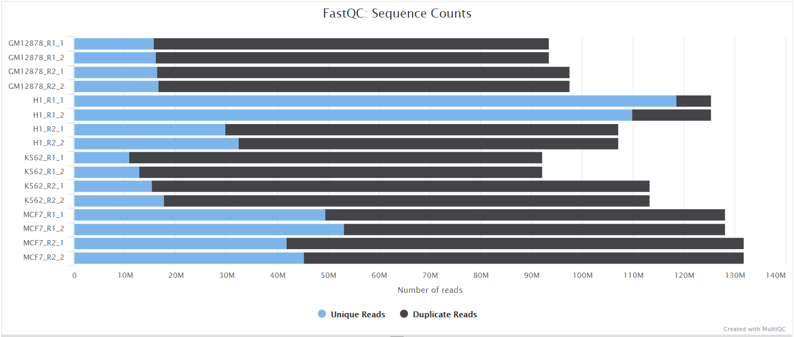
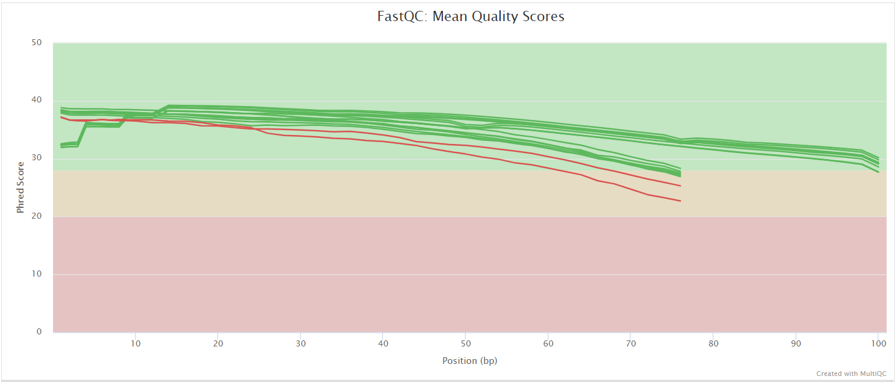
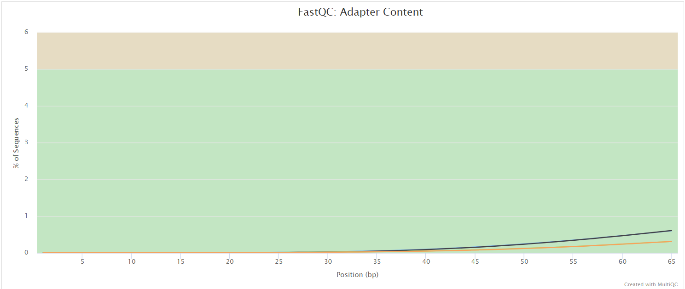

# vsearchpipeline: Output

## Introduction

This document describes the output produced by the pipeline. The directories listed below will be created in the results directory after the pipeline has finished. All paths are relative to the top-level results directory.

## Pipeline overview

The pipeline is built using [Nextflow](https://www.nextflow.io/) and processes data using the following steps:

- [FastQC](#fastqc) - Raw read QC
- [Seqtk](#seqtk) - Trim primers (optional)
- [VSEARCH](#vsearch) - Make ASV fasta and count table
- [VSEARCH mapping rate](#vsearch-mapping-rate) - Per-sample mapping rate summary
- [MAFFT](#mafft) - Multiple sequence alignment of ASVs (optional)
- [FastTree](#fasttree) - Phylogenetic tree from MSA (optional)
- [SILVA databases](#silva-databases) - Downloaded reference databases (optional)
- [DADA2 taxonomic assignment](#dada2-taxonomic-assignment) - Assign taxonomy using SILVA v138.2
- [PICRUSt2](#picrust2) - Functional potential prediction (optional)
- [Phyloseq](#phyloseq) - Downstream analysis in phyloseq objects
  - [Make phyloseq object](#make-phyloseq-object)
  - [Decontam](#decontam) - Remove contaminants (optional)
  - [Nicer taxonomy](#nicer-taxonomy)
  - [Metrics](#metrics)
  - [Rarefaction](#rarefaction) (optional)
- [MultiQC](#multiqc) - Aggregate QC report
- [Pipeline information](#pipeline-information) - Execution reports and software versions

---

### FastQC

Output files

- `fastqc/`
  - `*_fastqc.html`: FastQC report containing quality metrics.
  - `*_fastqc.zip`: Zip archive containing the FastQC report, tab-delimited data file and plot images.

[FastQC](http://www.bioinformatics.babraham.ac.uk/projects/fastqc/) gives general quality metrics about your sequenced reads. It provides information about the quality score distribution across your reads, per base sequence content (%A/T/G/C), adapter contamination and overrepresented sequences. For further reading and documentation see the [FastQC help pages](http://www.bioinformatics.babraham.ac.uk/projects/fastqc/Help/).

> [!NOTE]
> The FastQC plots displayed in the MultiQC report show _untrimmed_ reads. They may contain adapter sequence and potentially regions with low quality.

---

### Seqtk

Output files

- `seqtk/`
  - `*_1.trim.fastq.gz`: Primer-trimmed forward reads.
  - `*_2.trim.fastq.gz`: Primer-trimmed reverse reads.

[Seqtk](https://github.com/lh3/seqtk) trims primer sequences from the forward and reverse reads by removing a fixed number of bases equal to the length of the supplied primer sequences. This step is skipped if `--skip_primers` is set.

---

### VSEARCH

Output files

- `vsearch/`
  - `asvs.clustered.fasta`: ASVs resulting from `cluster_unoise3`.
  - `asvs_nonsingle.fasta`: ASVs after sorting and singleton removal.
  - `asvs_nonchimeras.fasta`: Final ASV set after `uchime3_denovo` chimera removal. ASVs are labelled `ASV_` followed by a number.
  - `chimeras.fasta`: Sequences identified as chimeras and removed.
  - `count_table.txt`: Per-sample ASV count table from `usearch_global`.
  - `*.filter_stats.txt`: Per-sample read filtering statistics from `fastq_filter`.

In a series of [VSEARCH](https://github.com/torognes/vsearch) processes, paired-end reads are converted into a final ASV set and count table:

1. **Merge** — `fastq_mergepairs` merges forward and reverse reads per sample.
2. **Filter** — `fastq_filter` filters merged reads (default: `maxee=1`, `maxns=1`).
3. **Dereplicate per sample** — `fastq_uniques` dereplicates reads within each sample.
4. **Dereplicate all** — all per-sample dereplicated reads are concatenated and dereplicated again (default: `minunique=2`).
5. **Cluster** — `cluster_unoise3` denoises sequences into ASVs (default: `minsize=8`, `alpha=2`).
6. **Sort & remove singletons** — `sortbysize` sorts ASVs and removes singletons (default: `minsize=2`).
7. **Chimera removal** — `uchime3_denovo` removes chimeric sequences using the UNOISE3 algorithm.
8. **Count table** — `usearch_global` maps the concatenated dereplicated reads back to the final ASVs to produce the count table.

---

### VSEARCH mapping rate

Output files

- `vsearch/`
  - `mapping_rate_summary.tsv`: Per-sample mapping rates (reads mapped / reads filtered).
  - `mapping_rate_overall.txt`: Overall mapping rate across all samples.

A Python summary script calculates the fraction of filtered reads that were successfully mapped back to the final ASV set by `usearch_global`, giving a per-sample and overall mapping rate.

---

### MAFFT

Output files

- `mafft/`
  - `asvs.msa`: Multiple sequence alignment of the final ASV sequences.

[MAFFT](https://mafft.cbrc.jp/alignment/software/) produces a multiple sequence alignment of the ASVs, which is used as input for phylogenetic tree inference. This step is skipped if `--skip_tree` is set.

---

### FastTree

Output files

- `fasttree/`
  - `asvs.msa.tree`: Phylogenetic tree inferred from the MSA.

[FastTree](https://www.microbesonline.org/fasttree/) infers an approximately maximum-likelihood phylogenetic tree from the MSA using the GTR+Gamma model. The tree is stored inside the phyloseq object if present. This step is skipped if `--skip_tree` is set.

---

### SILVA databases

Output files

- `silva_db/` _(only written if `--save_silva_db` is set)_
  - `SILVA_asv_db.fa.gz`: SILVA v138.2 genus-level reference database for `assignTaxonomy`.
  - `SILVA_species_db.fa.gz`: SILVA v138.2 species-level reference database for `addSpecies`.

If no pre-downloaded databases are supplied via `--silva_asv_db` and `--silva_species_db`, the pipeline downloads the SILVA v138.2 databases from Zenodo automatically. Use `--save_silva_db` to save them to the output directory so they can be reused in future runs via `--silva_asv_db` and `--silva_species_db`.

---

### DADA2: taxonomic assignment

Output files

- `dada2/`
  - `taxtable.csv`: Taxonomy table with genus-level assignments (`assignTaxonomy`) and species-level assignments (`addSpecies`).

[DADA2](https://benjjneb.github.io/dada2/) is used for taxonomic assignment against the SILVA v138.2 database. `assignTaxonomy` is run with `minBoot=80` and `addSpecies` with `allowMultiple=3` and `tryRC=TRUE` by default.

---

### PICRUSt2

Output files

- `picrust2/`
  - PICRUSt2 output files with predicted functional profiles.

[PICRUSt2](https://github.com/picrust/picrust2) predicts the functional potential of the microbial community from the ASV sequences and count table. This step is skipped if `--skip_picrust` is set.

---

### Phyloseq

#### Make phyloseq object

Output files

- `phyloseq/complete/`
  - `phyloseq.RDS`: Phyloseq object containing the count table, taxonomy table, ASV sequences, and phylogenetic tree (if present).
  - `phylo_raw_taxtable.csv`: Raw taxonomy table with one column per taxonomic level.

[Phyloseq](https://joey711.github.io/phyloseq/index.html) is an R package for microbiome data analysis. All data dimensions are combined into a single phyloseq object.

#### Decontam

Output files

- `phyloseq/decontam/`
  - `phyloseq_decontam.RDS`: Phyloseq object with contaminant ASVs removed.
  - `decontam_report.txt`: Report listing identified contaminants.
  - `decontam_contaminants.csv`: Table of ASVs flagged as contaminants.
  - `decontam_prev_plot.pdf`: Prevalence plot used for contaminant identification.

[Decontam](https://benjjneb.github.io/decontam/) identifies and removes contaminant ASVs based on prevalence in negative control samples defined in the samplesheet. This step runs only if `--run_decontam` is set. The decontaminated phyloseq object is used as input for all downstream steps.

#### Nicer taxonomy

Output files

- `phyloseq/complete/`
  - `taxtable_complete.RDS`: Taxonomy table with assembled human-readable names (e.g. _Roseburia hominis_ or _Roseburia_ spp.).
  - `phylogen_levels_complete.csv`: Percentage of ASVs with a known assignment at each taxonomic level.
  - `phylogen_levels_top300_complete.csv`: Same, restricted to the top 300 most abundant ASVs.
- `phyloseq/rarefied/` _(same files with `_rarefied` suffix, if rarefaction is run)_

Taxonomy names are assembled from the most specific known taxonomic level, producing publication-ready names. This step is skipped if `--skip_fixtaxonomy` is set.

#### Metrics

Output files

- `phyloseq/complete/`
  - `composition_phylum_complete.pdf`: Stacked bar chart at phylum level.
  - `composition_family_complete.pdf`: Stacked bar chart at family level.
  - `composition_genus_complete.pdf`: Stacked bar chart at genus level.
  - `composition_species_complete.pdf`: Stacked bar chart at species level.
  - `shannon_index_complete.pdf`: Shannon diversity histogram.
  - `species_richness_complete.pdf`: Species richness histogram.
  - `metrics_overview_complete.txt`: Summary of composition and diversity metrics.
- `phyloseq/rarefied/` _(same files with `_rarefied` suffix, if rarefaction is run)_

Overview composition and diversity plots are generated for the complete (and optionally rarefied) dataset. This step is skipped if `--skip_metrics` is set.

#### Rarefaction

Output files

- `phyloseq/rarefied/`
  - `phyloseq_rarefied.RDS`: Rarefied phyloseq object.
  - `rarefaction_plot.pdf`: Histogram of total counts per sample with a line indicating the rarefaction depth.
  - `rarefaction_report.txt`: Report of the rarefaction process including the chosen depth.

Rarefaction subsamples all samples to an equal sequencing depth. The rarefaction level is set by `--rarelevel`; if not provided, an automatic rule is applied (mean − 3 SD, or median − IQR, with a minimum of 15,000 if achievable). This step is skipped if `--skip_rarefaction` is set.

> [!NOTE]
> It is generally recommended to inspect the count distribution carefully before deciding on a rarefaction level. Consider running the pipeline without rarefaction first.

---

### MultiQC

Output files

- `multiqc/`
  - `multiqc_report.html`: Standalone HTML report summarising QC across all samples.
  - `multiqc_data/`: Directory containing parsed statistics from all tools.
  - `multiqc_plots/`: Static images from the report in various formats.

[MultiQC](http://multiqc.info) aggregates QC results from FastQC and the pipeline workflow summary into a single interactive HTML report.

---

### Pipeline information

Output files

- `pipeline_info/`
  - `execution_report.html`: Nextflow execution report with per-process resource usage.
  - `execution_timeline.html`: Timeline of process execution.
  - `execution_trace.txt`: Detailed trace of all tasks.
  - `pipeline_dag.dot` / `pipeline_dag.svg`: Directed acyclic graph of the workflow.
  - `software_versions.tsv`: Tab-separated table of all software versions used (`process`, `software`, `version`).
  - `git_commit_hash.txt`: Git commit hash of the exact pipeline version used, for full reproducibility.

[Nextflow](https://www.nextflow.io/docs/latest/tracing.html) generates execution reports, timelines and traces for every run. The pipeline also records all software tool versions to `software_versions.tsv` and the exact pipeline commit to `git_commit_hash.txt`.
